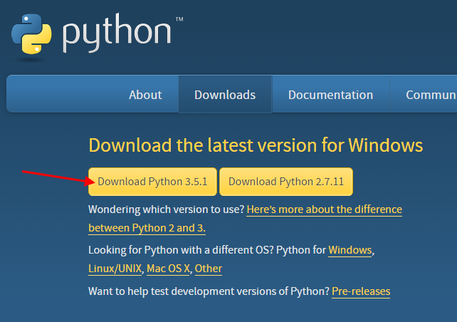

Einrichtung einer Entwicklungsumgebung für das Programmieren mit
Python
======

Für das Programmieren mit Python ist es notwendig einige Programme zu
installieren. Welche das sind, wofür diese benötigt werden, wo ihr diese
herunterladen könnt und wie sie installiert werden wird im Folgenden
kurz beschrieben. Die Installationsanleitung bezieht sich auf Windows,
da auch die Kursrechner mit Windows ausgestattet sind. Solltet ihr Hilfe
bei der Einrichtung der genannten Software auf anderen Betriebssystemen
benötigen, dann könnt ihr uns jederzeit ansprechen.

Python
======

Für das Programmieren mit Python brauchen wir selbstverständlich Python.

Ladet hierfür den Installer von folgender Seite herunter:

https://www.python.org/downloads/

Zum Zeitpunkt der Erstellung dieser Installationsanleitung ist die
Version 3.5.1 die Aktuellste.

Nachdem der Installer von eurem Browser erfolgreich heruntergeladen
wurde könnt ihr diesen mit einem Doppelklick ausführen.

Wichtig ist, dass ihr den Hacken für das Setzen der
PATH-Systemvariablen. Dies nimmt uns bei der Installation der
Entwicklungsumgebung PyCharm viel Arbeit ab.

Führt den Installer anschließend mit den Standardeinstellungen aus.

PyCharm
=======

Für die Entwicklung mit Python empfiehlt es sich eine
Entwicklungsumgebung einzurichten. Diese bietet nicht nur einen
komfortablen Editor, sondern auch jede Menge Hilfsfunktionen, die euch
beim Programmieren das Leben leichter machen. Für Java gibt es
verschiedene Optionen, wobei wir im Folgenden PyCharm verwenden werden,
da diese IDE sehr benutzerfreundlich, leistungsstark und in der
Community Edition kostenlos ist.

Ladet also nun PyCharm von der JetBrains-Webseite herunter. Der Link
lautet wie folgt:

https://www.jetbrains.com/pycharm/

Wichtig ist, dass ihr die Community Edition herunterladet. Der folgende
Screenshot zeigt wo ihr klicken müsst:

Nachdem euer Browser den Installer erfolgreich runtergeladen hat könnt
ihr diesen mit einem Doppelklick ausführen.

Ihr könnt die Installation mit den Standardeinstellungen durchführen.
Wichtig ist nur, dass ihr eine Desktop-Icon anlegen und die Dateiendung
.py mit PyCharm verbinden lasst.

Das wars! Jetzt ist alles vorbereitet. Wie das genau geht erfahrt ihr im
Kurs. Viel Spaß!
